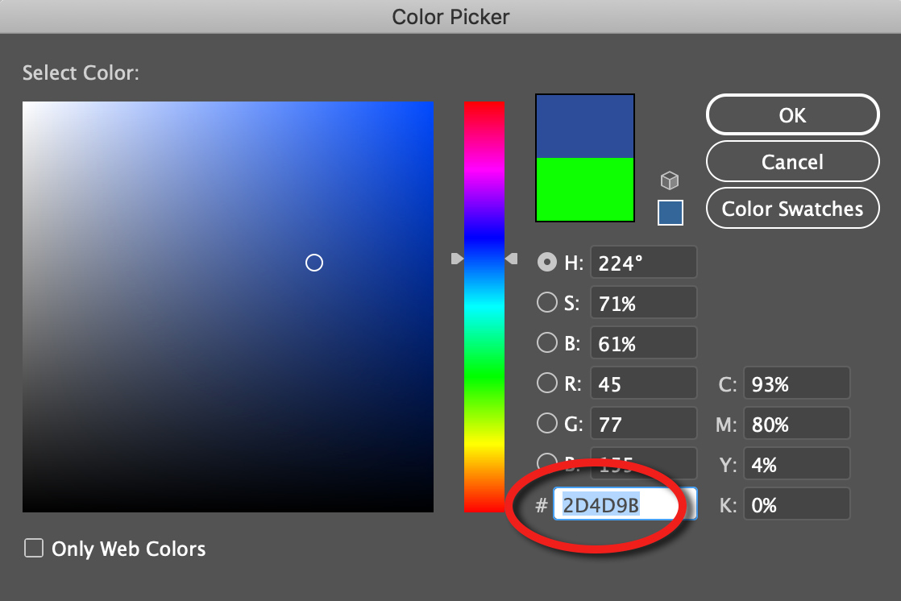

# Class 1

This lecture was initially part of a lecture series at New York University and was initially co-written by Craig Pickard.

## A Short History of Computing

The very first electromechanical computers comprised electric switches driving mechanical relays. Later, around the 1930s, mechanical relays were replaced by vacuum tubes. This greatly increased the capabilities and operating speed of these early machines.

Perhaps the single greatest invention in the history of computing was that of the bipolar transistor. Why? They're smaller, require less power, generate less heat, and are more reliable.

The next great advance came in the form of the integrated circuit (IC), also referred to as a microchip. An IC is a set of electronic circuits on a single plate of semiconductor material ( usually silicon ). Several billion transistors (and other components) can fit onto a chip the size of a human fingernail. This, in turn, led to the invention of the microprocessor. A microprocessor takes input, performs some sort of operation ( processing ), and produces an output.

A computer's Central Processing Unit ( CPU ) is the primary component of a computer that processes instructions. It runs the operating system and applications, constantly receiving input from the user or active software programs. It processes the data and produces output, which may stored by an application or displayed on the screen. The terms "CPU" and "processor" are often used interchangeably. Some technical diagrams even label individual processors as CPUs. While this verbiage is not incorrect, it is more accurate (and less confusing) to describe each processing unit as a CPU, while each processor within a CPU is a processing core.

For example, a CPU has a clock speed of 1 Hz if it can process one piece of instruction every second. Extrapolating this to a more real-world example: a CPU that has a clock speed of 3.0 GHz can process 3 billion instructions each and every second.

Another component of a CPU is cache. CPU cache is like a temporary holding for commonly used data. Instead of calling on RAM for these items, the CPU determines what data you seem to keep using, assumes you'll want to keep using it, and stores it in cache. Cache is faster than using RAM because it's a physical part of the processor; more cache means more space for holding such information.

Whether your computer can run a 32-bit or 64-bit operating system depends on the size of data units that the CPU can work with. More memory can be accessed at once and in larger pieces with a 64-bit processor than a 32-bit one, which is why operating systems and applications that are 64-bit-specific cannot run on a 32-bit processor.

At this point, you've probably heard the term 'bit' before ('bit' stands for 'binary digit' ). Why is this relevant? Remember we were talking about the invention of the transistor - well, a transistor is essentially a small electronic switch. Like a light switch, it has two possible states: On and Off. A transistor has two possible states: High and Low. We can represent this as the binary numbers 1 or 0.


## Decimal, Binary, & Hexadecimal

#### Decimal

You are use to the decimal (decem is latin for ten) notation, which uses ten numbers 0-9. If you need to represent a number larger than nine, you use a combination of these numbers.

Let's look at the number **437**

We can write this several ways:
400 + 30 + 7
4 * 100 + 3 * 10 + 7 * 1
4 * 10<sup>2</sup> + 3 * 10<sup>1</sup>+ 7 * 10<sup>0</sup>

so

| 4                | 3                | 7                |
| ---------------- | ---------------- | ---------------- |
| 4*10<sup>2</sup> | 3*10<sup>1</sup> | 7*10<sup>0</sup> |

Note that just like we have **10** possible numbers in decimal notation, this is also a base **10** system. 437 has a hundreds place, a tens place, and a ones place, which are all base **10**.

#### Binary

*Binary* is similar to decimal notation but instead of 10 numbers (0-9) and base 10, we have 2 (0 & 1) numbers and it is base 2. So instead of a ones place, tens place, hundreds place, etc, we have a ones place, a twos place, a fours place, an eight place, etc.

Let's look at the numbers zero through eight, in binary and decimal.

| Binary | Decimal |
| ------ | ------- |
| 0      | 0       |
| 1      | 1       |
| 10     | 2       |
| 11     | 3       |
| 100    | 4       |
| 101    | 5       |
| 110    | 6       |
| 111    | 7       |
| 1000   | 8       |

Let's break this down a bit with the binary number **101110011**

| 1               | 0               | 1               | 1               | 1               | 0               | 0               | 1               | 1               |
| --------------- | --------------- | --------------- | --------------- | --------------- | --------------- | --------------- | --------------- | --------------- |
| 1*2<sup>8</sup> | 0*2<sup>7</sup> | 1*2<sup>6</sup> | 1*2<sup>5</sup> | 1*2<sup>4</sup> | 0*2<sup>3</sup> | 0*2<sup>2</sup> | 1*2<sup>1</sup> | 1*2<sup>0</sup> |

add this all together and you get **371** in decimal.

Why do we care about binary? Inside of a computer are billons of transistors. Each are activated by an electronic signal. What are the possible outputs of this signal?

**0 or 1**

That's it! So whether you are using a calculator or playing a multi-player online game, the computer understands all of it as a series of 0s and 1s.

How does that work? We'll go more into this process later but all code is converted into binary (ie a machine readable format).

#### Hexadecimal

So what's hexadecimal? If you've used an advanced color picker before, you may have seen it!



`#2D4D9B` is hexadecimal. We can tell because there's a # followed by a series of numbers and letters between A and F. It can also be written as `0x2D4D9B` where 0x indicates a hex number.

Hexadecimal follows the same rules as binary and decimal except it's based 16. Because we use the latin numeral system which only has ten numbers, we use A,B,C,D,E & F to represent 10-15.

| 0    | 1    | 2    | 3    | 4    | 5    | 6    | 7    | 8    | 9    | 10   | 11   | 12   | 13   | 14   | 15   |
| ---- | ---- | ---- | ---- | ---- | ---- | ---- | ---- | ---- | ---- | ---- | ---- | ---- | ---- | ---- | ---- |
| 0    | 1    | 2    | 3    | 4    | 5    | 6    | 7    | 8    | 9    | A    | B    | C    | D    | E    | F    |

Let's look at the hex number **D8AF**

| D                 | 8                | A                 | F                 |
| ----------------- | ---------------- | ----------------- | ----------------- |
| 13*16<sup>3</sup> | 8*16<sup>2</sup> | 10*16<sup>1</sup> | 15*16<sup>0</sup> |

So we can think of #D8AF as (13 x 16<sup>3</sup>) + (8 x 16<sup>2</sup>) + (10 x 16<sup>1</sup>) + (15 x 16<sup>0</sup>) which is 55471 in decimal.

So why use hexadecimal? Hex codes are used as a way to make binary more human readable (maybe not all humans but that's not the point). Computers cannot read hex, and any hex codes it encounters are translated to binary. While it seems wild to think hexadecimal is more user-friendly, #FF6600 (also know as orange) is certainly easier than 1111 1111 0110 0110 0000 0000. As you get further into programming, you may also notice hex codes in your error messages. This refers to a specific memory location which can be helpful in the debugging process... but we'll get to that later.

## Bits and Bytes

As we mentioned previously, a 'bit' is a 'binary digit'. Now that we understand a little more about binary, it's time to introduce the concept of a 'byte'. A byte is simply a collection of 8 individual bits - In other words 2<sup>8</sup> (256) possible combinations. If you're old enough to remember the early days of personal computers and floppy disks, you might remember that they stored around 1.44 megabytes of data. Let's think about that for a second... the prefix 'mega' denotes 10<sup>6</sup> or ( 1 000 000 ), so a 'mega'-'byte' is essentially 10<sup>6</sup> x 2<sup>8</sup> bits. That's 256,000,000 individual 1s and 0s. However, this isn't 100% correct... because computer's think in 1s and 0s ( ie binary numbers ), it makes sense that values are stored as powers of two. In other words, instead of a kilobyte (ie, 1kb) being 10<sup>3</sup>, or 1000 bytes, it is in fact 210 bytes ( or 1024 bytes ). Just remember that computers think in binary, ie powers of 2!

Let's pause and take a second to think about what a byte actually is. We already know that a byte is a combination of 8 consecutive bits. But what's the significance of this? If you recall, the RGB colour system uses values from 0-255. Coincidence? I think not! Each colour channel stores exactly 1 byte of data, or a value from 0 to 255. This means that in order to represent the colour of a single pixel, we need exactly 3 bytes of memory, or enough space to store 3 x 8bits at a resolution of 0-255.


In a very simple sense, your computer's memory is represented in physical space by a collection of transistors ( hundreds of millions of them ). In order to store the colour information for a single pixel we need 3 bytes, or 24 bits, which means 24 individual transistors will hold the desired combination of high and low charges, representing the 0 and 1 values.

As it turns out, 8bits of data (or a single byte) is a very convenient size for storing all kinds of different information. For example, every character/letter/number that's found on your keyboard fits into a single byte. This is thanks to a system called ASCII.

## ASCII

ASCII is an abbreviation for *American Standard Code for Information Interchange*. It's a character-encoding scheme used to represent text in a computer. Each ASCII character can be stored in a single byte because it's represented by a decimal number within the range of 0-255. The image below shows the ASCII character table. Each character is represented by a decimal number, which is in turn stored in binary as a combination of 8 bits. For example, the lowercase 'a' is represented in decimal as 97. This would be stored in a single byte of memory as the binary number 1100001.

*Note that ASCII is only used for the English language. Unicode uses between 8 and 32 bits of data to represent characters from a more diverse group of languages.*

Below is a table showing the mapping of ASCII characters to their decimal representation. [](https://camo.githubusercontent.com/c267688163f9434ec46f719f31c47038724e59d485a91a371fe63e76305062a4/687474703a2f2f7777772e617363696963686172732e636f6d2f5f736974655f6d656469612f61736369692f61736369692d63686172732d6c616e6473636170652e6a7067)

## Memory

If you work with a computer, there's a good chance you've heard someone refer to its 'memory', but what exactly does that mean? At this point it's important to make the distinction between 'memory' and 'storage'. Your computer's hard disk drive (HDD) is a data storage device. Traditional HDDs use rigid rapidly rotating discs covered with magnetic material. Magnetic heads on moving actuator arms read and write data to these discs. 'Saving' a file on your computer's hard drive involves the moving actuator arms writing data to the disc by magnetizing specific 'sectors' on the disc itself. This 'permanent' storage is known as non-volatile memory. The term 'non-volatile' refers to the fact that the data is retained, even after the HDD is powered off. Another form of storage happens in *flash memory*. Portable storage devices like USB drives make use of flash memory and are referred to as Solid State Drives ( SSD ). SSDs make use of semiconductor chips, rather than magnetic media, to store data.

Perhaps you've heard the term 'RAM', but perhaps not. RAM stands for 'Random Access Memory' and is more often than not the specific form of memory people are referring to when they talk about a computer's 'memory'. For instance, if you're looking to buy a new laptop, one of the first things you look for in the specification is its memory, ie. how many gigabytes ( GB ) of RAM does it have. Why is this important? By it's very nature, accessing your computer's RAM is incredibly fast! The reason for this is inferred from it's name, ie. 'random access'. RAM is a form of integrated circuit. RAM's speed is a result of the fact that data can be read and/or written at the same speed no matter where in the memory the data is stored. Read/Write speeds of storage like HDDs depends very much on the data's physical location on the disc. Okay, now we know what RAM is, but what do we do with it?

When you double click an executable file on your computer ( for example a .exe file on Windows, or an application on Mac OSX ), or you run a sketch that you've created in something like p5.js, processing, openFrameworks, or Cinder, your computer allocates it a large chunk of contiguous ( meaning sequential ) memory in your RAM. In a physical sense we can think of this as n-number of sequential transisors set aside to store n-bytes of data ( the size is of which determined by your computer at runtime ). We can think of this conceptually as a 'block' of memory. Now, the important thing to understand here is that your computer keeps track of the location of where every byte of data is stored. It does this using something called a memory *address*. You can think of it as being analogous to your street address where you live. You can give someone your address, which is essentially just a collection of characters ( remember ASCII ), and they'll know how to find you. The location of each byte in memory has a physical address ( that looks something like this **0x101d00a70** <-- there's hexadecimal again! ), which tells the computer where to look for that specific piece of data. So how do we store information at one of these addresses? We do this using *variables*.

## Variables

A variable essentially represents a piece of data that is stored at a specific location in your computers physical memory. If you think about it, you can change the value of the variable, but the variable name itself remains unchanged. In the same way, think about the house or apartment that you currently live in, the address never changes, but over the years the occupants change.

In most languages (not python), you need to tell the computer what *type* of variable you want. This is the key difference between **Static Typing** and **Dynamic Typing**.

- Static Typing is where the type is bound to a variable. Types are checked at compile time. Java, C++, and C are static typed languages.
  - In Java, for example
    `String s = "text";`
    s will be a string forever. We can change "text" to something different or assign it to null, but s will never be an int or a boolean.
- Dynamic Typing is where the type is bound to the value. Types are checked at run time. Javascript, PHP, and Python are dynamically typed languages.
  - In JavaScript, for example

```
var a = "text";
a = 123;
a = [];
```

a can be a string, an int, a list, an object, etc.

There are 4 main types: integers ( whole numbers - both negative and positive ), floats ( values that have a decimal point - both positive and negative ), char ( ASCII characters ) and doubles ( double-precision floating point numbers ). There are additional data types, and variations of the ones we mentioned, but for now we'll focus on these as they're probably the most important. Each data type can store a specific amount of information. In other words, each data type specifies how much data the variable can store:

- int - 4 bytes ( 32 bits ), with a range of −32,768 to 32,767
- float - 4 bytes (32 bits )
- char - 1 byte ( 8 bits )
- double - 8 bytes ( 64 bits )

So, to summarize, declaring and intializing ( ie. assigning it a value ) a variable of a specific type tells the computer 2 things. First, the physical location in memory where the data should be stored. Second, how many bytes to set asideto store said data.

To use a variable there are two steps:

1. Declare - here you declare to the compiler that you are going to use the variable you have declared. A declaration contains 2 parts, a data type (if you are using a dynamically typed language) and a name.
   - [ ] Example: `int x;` In dynamically typed languages we tend to declare and assign at the same time
2. Assignment - here you give your variable a value using the equal sign. *You must declare a variable before you can assign it a value.*
   - [ ] Example: `x=42;`

You can also declare and assign variables in one line: `int x = 42;`(statically typed) OR `x = 42`(dynamically typed)

It is good practice to have descriptive variable names like `length_squared` or `number_of_coins`. For C languages, like C++, and Python it is convention to have all variable names all lowercased with underscores between words.

Let's look at the following code (the following code snippets are examples of a statically typed language)

```java
int x = 42;
int y = x + 1;
x = 5;
```

What is y now equal to? If you said 43, you're correct. Even though x now equals 5, when y was assigned, x equaled 42, so y will stay at 43, regardless of what x is assigned to afterwards.

Let's look at another block of code:

```java
int x;
x = x + 1;
```

See the problem? We assign x after we declare it, but x has no value, or is null, and something plus nothing, is not only nothing, it's an error.

## Algorithms

An algorithm is a set of step-by-step instructions a computer program follows to do something

- Just like a recipe or a set of driving directions
- Most often, there are multiple ways to write a single algorithm
  - Usually there is no single 'best' option, each algorithm will have pros and cons
  - General rule to determine if you have a 'good' algorithm is to keep it DRY (don't repeat yourself)
